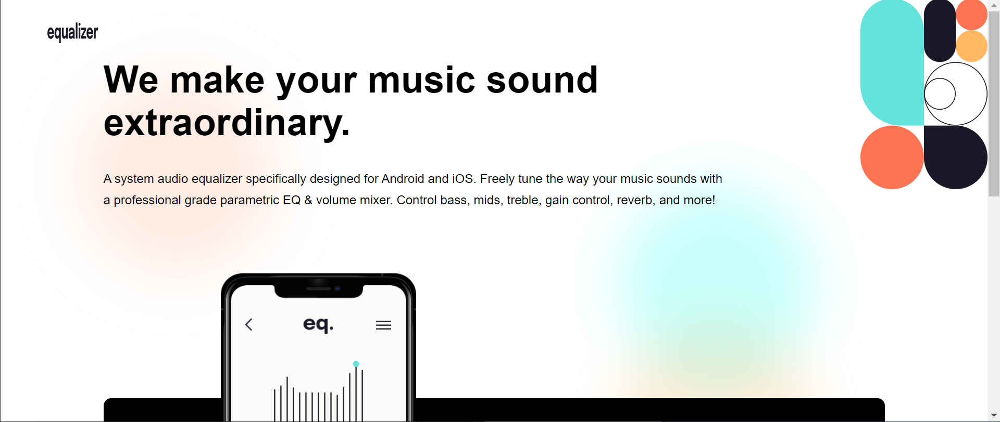
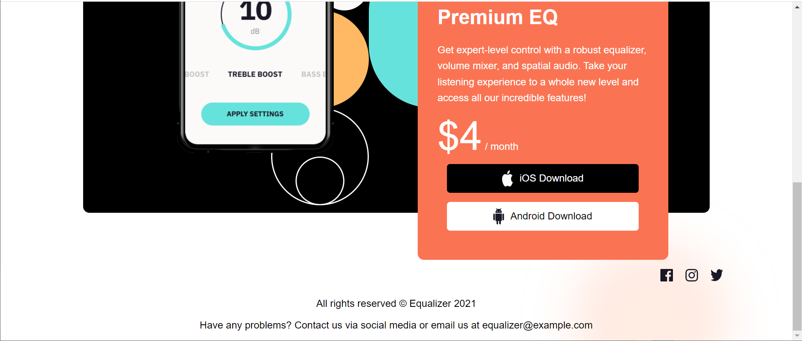

# Frontend Mentor - Equalizer landing page solution

This is a solution to the [Equalizer landing page challenge on Frontend Mentor](https://www.frontendmentor.io/challenges/equalizer-landing-page-7VJ4gp3DE). Frontend Mentor challenges help you improve your coding skills by building realistic projects.

## Table of contents

-  [Overview](#overview)
   -  [The challenge](#the-challenge)
   -  [Screenshot](#screenshot)
   -  [Links](#links)
-  [My process](#my-process)
   -  [Built with](#built-with)
   -  [What I learned](#what-i-learned)
-  [Author](#author)
-  [Acknowledgments](#acknowledgments)

**Note: Delete this note and update the table of contents based on what sections you keep.**

## Overview

### The challenge

Users should be able to:

-  View the optimal layout depending on their device's screen size
-  See hover states for interactive elements

### Screenshot

### Links

-  Solution URL: (https://github.com/ThomasAurelius/fm_equalizer_landing_page)
-  Live Site URL: (https://thomasaurelius.github.io/fm_equalizer_landing_page/)

## My process

### Built with

-  Semantic HTML5 markup
-  CSS custom properties
-  Flexbox
-  CSS Grid
-  Mobile-first workflow

### What I learned

The colors don't match from the preview files to the assets! The orange in the assets is lighter, than it is in the preview. I used color capture to copy it from the bg-icon-1.

## Author

-  Website - [Thomas Aurelius](https://thomasaurelius.com)
-  Frontend Mentor - [@ThomasAurelius](https://www.frontendmentor.io/profile/ThomasAurelius)
-  Twitter - [@thomasaurelius4](https://www.twitter.com/yourusername)
